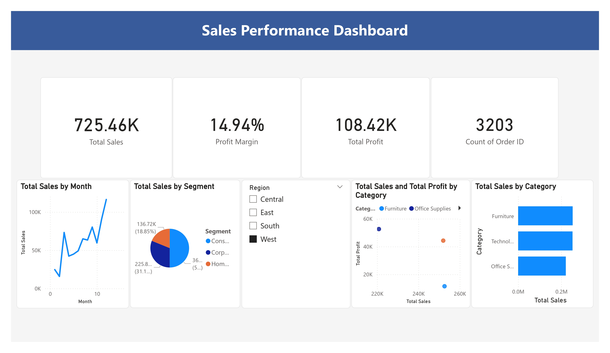
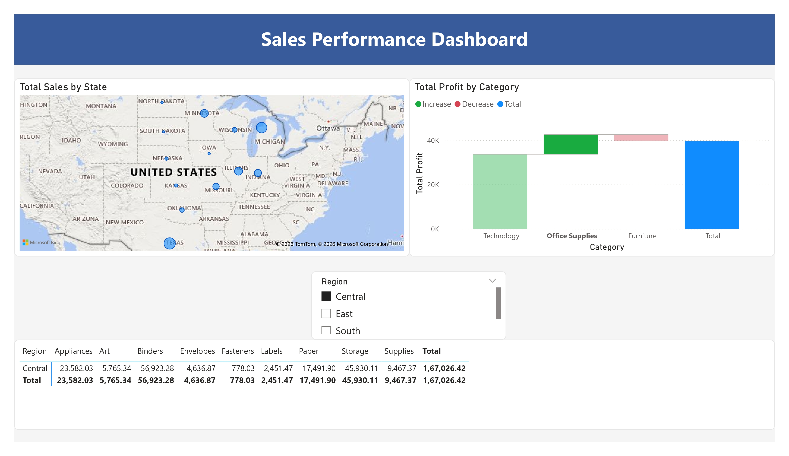

# Sales Performance Dashboard

<p align="center">
  
  
  
  
  
</p>

<p align="center">
  A professional two-page Power BI dashboard that transforms 9,994 US retail sales transactions into actionable insights — tracking KPIs, monthly trends, geographic distribution, and category-level profitability through nine interactive visualizations.
</p>

---

## Dashboard Preview

<table>
  <tr>
    <td align="center"><b>Page 1 — Sales Overview</b></td>
    <td align="center"><b>Page 2 — Geographic & Category Analysis</b></td>
  </tr>
  <tr>
    <td></td>
    <td></td>
  </tr>
</table>

---

## Table of Contents

- [Problem Statement](#problem-statement)
- [Solution Overview](#solution-overview)
- [Dashboard Pages](#dashboard-pages)
- [Key Features](#key-features)
- [Tech Stack](#tech-stack)
- [Repository Structure](#repository-structure)
- [Getting Started](#getting-started)
- [Key Insights](#key-insights)
- [Future Improvements](#future-improvements)
- [Author](#author)

---

## Problem Statement

In today's competitive retail environment, businesses generate thousands of sales transactions daily across multiple product categories, customer segments, and geographic regions. Raw transactional data stored in spreadsheets is nearly impossible for managers to interpret quickly and accurately.

**This project addresses the following core challenges:**

- No quick, visual way to monitor KPIs such as Total Sales, Profit, Profit Margin, and Order Count
- Inability to track monthly revenue trends or identify seasonal patterns at a glance
- No geographic view of which US states and regions are driving the most revenue
- Lack of an interactive, filter-based drill-down tool for non-technical business users

---

## Solution Overview

A two-page interactive Power BI Dashboard built on the **Kaggle US Superstore Sales** dataset — 9,994 sales records across three product categories and four geographic regions. The dashboard processes raw CSV data through a Python/Pandas cleaning pipeline before modeling in Power BI, ensuring analytical accuracy throughout.

---

## Dashboard Pages

### Page 1 — Sales Overview

Delivers an executive-level snapshot of overall business performance.

| Visual | Description |
|--------|-------------|
| KPI Cards | Total Sales: `725.46K` · Total Profit: `108.42K` · Profit Margin: `14.94%` · Orders: `3,203` |
| Line Chart | Total Sales by Month — tracks revenue trend and seasonal peaks across the year |
| Pie Chart | Total Sales by Segment — Consumer `31.1%` · Corporate `18.85%` · Home Office `50.05%` |
| Scatter Plot | Total Sales vs. Total Profit by Product Category |
| Bar Chart | Total Sales by Product Category (Furniture, Technology, Office Supplies) |
| Region Slicer | Interactive filter — Central, East, South, West — updates all visuals instantly |

### Page 2 — Geographic & Category Deep Dive

Provides state-level geographic analysis and category profit decomposition.

| Visual | Description |
|--------|-------------|
| Bing Map | Total Sales by US State — bubble size proportional to revenue |
| Waterfall Chart | Total Profit by Category — Increase (green) · Decrease (red) · Total (blue) |
| Matrix Table | Sales by Region × Sub-Category — Appliances, Art, Binders, Envelopes, Fasteners, Labels, Paper, Storage, Supplies — with grand totals |

---

## Key Features

| Feature | Details |
|---------|---------|
| **KPI Summary Cards** | Four critical business metrics visible at a glance on page load |
| **Monthly Trend Line** | Tracks revenue month-by-month revealing seasonal peaks and dips |
| **Waterfall Chart** | Decomposes profit by category into Increase / Decrease / Total — more insightful than a plain bar chart |
| **Scatter Plot** | Two-dimensional Sales vs. Profit view exposing high-revenue but low-margin categories |
| **Bing Bubble Map** | State-level sales concentration across the entire US at a glance |
| **Region × Sub-Category Matrix** | Full 360° breakdown of sales across all regions and nine product sub-categories |
| **Synchronized Region Slicer** | Filters all nine visuals across both pages simultaneously — no page navigation needed |
| **Python-Cleaned Dataset** | Pre-processed via Pandas before Power BI import — dates formatted, duplicates removed, derived fields engineered |

---

## Tech Stack

| Technology | Role |
|------------|------|
| **Python / Pandas** | Data cleaning — datetime formatting, duplicate removal, null handling, derived columns (Profit Margin, Days to Ship) |
| **Jupyter Notebook** | Python cleaning workflow documented and reproducible |
| **Power BI Desktop** | Dashboard design, Power Query data modeling, DAX Date Table via `CALENDAR()`, nine interactive visuals |
| **DAX** | Custom measures — `Total Sales`, `Total Profit`, `Profit Margin %`, `Count of Orders` |
| **Kaggle Superstore CSV** | 9,994 US retail transactions (2015–2018) — Sales, Profit, Discount, Category, Sub-Category, Segment, State, Region |
| **GitHub** | Version control and public hosting of all project files for evaluation access |

---

## Repository Structure

```
sales-performance-dashboard/
│
├── Sales_Performance_Dashboard.pbix          # Main Power BI dashboard file
├── Sales_Dashboard_Report.docx               # Project report (Word)
├── Sales_Performance_Dashboard.pdf           # Project report (PDF)
├── SampleSuperstore.csv                      # Cleaned source dataset
├── Sales_Performance_Dashboard_page-0001.jpg     # Screenshot — Page 1
├── Sales_Performance_Dashboard_page-0002.jpg                      # Screenshot — Page 2
└── README.md
```

---

## Getting Started

### Prerequisites

- [Power BI Desktop](https://powerbi.microsoft.com/desktop/) — free download from Microsoft
- Python 3.x with `pandas` — only needed if re-running the data cleaning notebook

### Steps

**1. Clone the repository**
```bash
git clone https://github.com/anshhh1101/sales-performance-dashboard.git
cd sales-performance-dashboard
```

**2. Open the dashboard**

Launch `Sales Performance Dashboard.pbix` in Power BI Desktop.

**3. Explore KPIs and trends**

Page 1 loads with all four KPI cards and the monthly trend chart. Use the **Region Slicer** to filter all visuals for any combination of Central, East, South, and West.

**4. Drill into geography and categories**

Navigate to **Page 2** to explore state-level sales concentration on the map, the waterfall profit breakdown, and the Region × Sub-Category matrix table.

---

## Key Insights

- **West region** leads in Total Sales (`3.23M`) with the highest profit contribution (`77.3K`)
- **Technology** is the most profitable category at `~145K` total profit
- **Furniture** is the most revenue-generating category but delivers the lowest profit margin
- **Consumer segment** drives the largest revenue share at ~50% of total sales
- **California, New York, and Texas** are the top three states by sales volume
- **Binders** and **Storage** are the highest-revenue sub-categories within Office Supplies (`56.9K` and `45.9K`)

---

## Future Improvements

- [ ] Customer RFM Analysis — DAX-based Recency, Frequency, Monetary scoring to classify customers as Champions, Loyal, At-Risk, or Lost
- [ ] Sales Forecasting — embedded Python visual using Facebook Prophet or ARIMA for 3–6 month revenue projection
- [ ] Discount Impact Analysis — dedicated page examining discount rate vs. profit margin across categories and sub-categories
- [ ] Live Data Connection — replace static CSV with a direct SQL database or API connection for automatic refresh
- [ ] Mobile-Optimized Layout — Power BI Phone Layout view for field sales access on smartphones

---

## Author

**AnshumaanAnand** · [@ANSHUMAAN2023](https://github.com/ANSHUMAAN2023)

---

<p align="center">If you found this project useful, consider giving it a ⭐</p>
